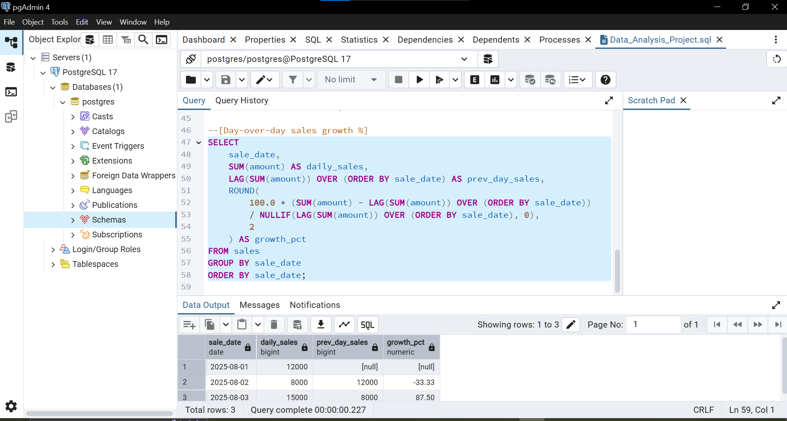
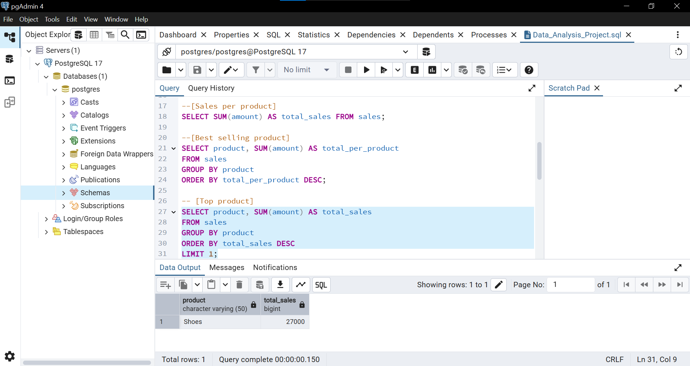
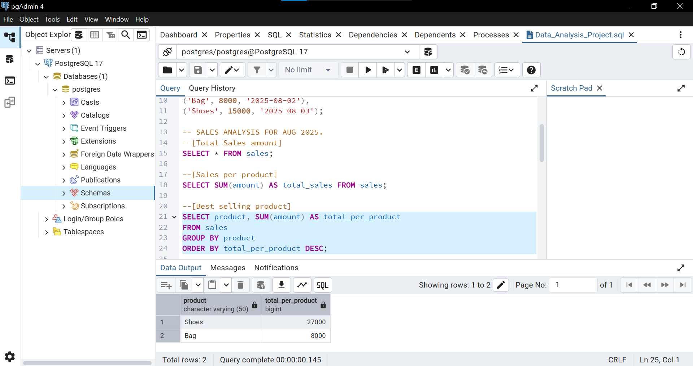

# Sales Analysis with PostgreSQL

A beginner portfolio project analyzing sample sales data using PostgreSQL. 
Covers aggregation, filtering, grouping, sorting, and window functions.

## What I Built
I created a `sales` table and wrote 6 SQL queries to answer business questions like:
- Total revenue and average order value
- Revenue by product category
- Top 5 products by sales
- Customers with more than 1 order
- Daily sales totals
- Day-over-day growth using `LAG` window function

## Key Queries

### 1. Day-over-Day Growth
Used `LAG` and `OVER (ORDER BY sale_date)` to compare each day's sales to the previous day.

### 2. Top Products
Found the top 5 products by revenue using `GROUP BY`, `ORDER BY`, and `LIMIT`.

### 3. Revenue by Category
Aggregated sales data to see which category performs best.

## Tools Used
- **PostgreSQL 17** - Database
- **pgAdmin 4** - SQL editor and query tool

## What I Learned
- How to write and run SQL queries in PostgreSQL
- Using `GROUP BY`, `HAVING`, and `ORDER BY` to summarize data
- Using window functions like `LAG` for time-based analysis
- Formatting SQL for readability and portfolio presentation

## How to Run This
1. Install PostgreSQL and pgAdmin
2. Run the `CREATE TABLE` and `INSERT` statements in `schema.sql`
3. Run the queries in `queries.sql`

---

*Built as part of my SQL learning path to practice data analysis skills.*
